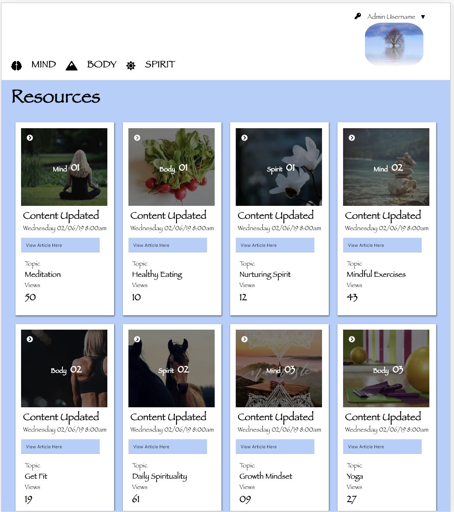

<h1> Static Comp</h1>

This is a static comp of a mock website (see images below). I had a week and a half to create a responsive comp using HTML and CSS. I could use any topic, images, content, and color scheme that I wanted to. I chose a wellness-based topic. Creating the media queries was eaiser than last time. Aligning all contents in the cards and the header using flexbox was a bit challenging.

<h2>Original Mock Up</h2>

<h2>KL:Static Comp</h2>
